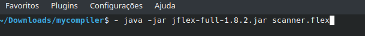
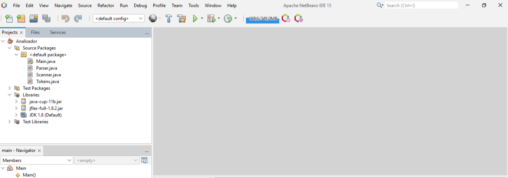

# Olá, seja bem vindo(a) a linguagem MY

## Requisitos
### - Java
### - Netbeans IDE 15

## Siga os seguintes passos para começar a utiliza-la.

### 1° Realize um clone do projeto em seu computador:
#### -  Acesse: https://github.com/matuane/mycompiler

### 2° Em seguida, crie uma nova biblioteca JFlex, importando os arquivos -java-cup-11b.jar -jflex-full-1.8.2.jar contidos na biblioteca "jflex-1.8.2" obtidas pelo site oficial jflex.de e no site do jcup.
#### - Para isso execute os dois comandos na raiz do seu projeto:
####    - java -jar jflex-full-1.8.2.jar scanner.flex
####    - java -jar java-cup-11b.jar -parser Parser -symbols Tokens parser.cup

### 3° Importar pasta de arquivos no Netbeans
### 4° Compilar projeto, clicando em "Run Project"

Ao Executar o projeto haverá um arquivo .txt com os tokens encontrados.

Autores: Mateus Antuane Gonçalves e Yan Pablo Alves
